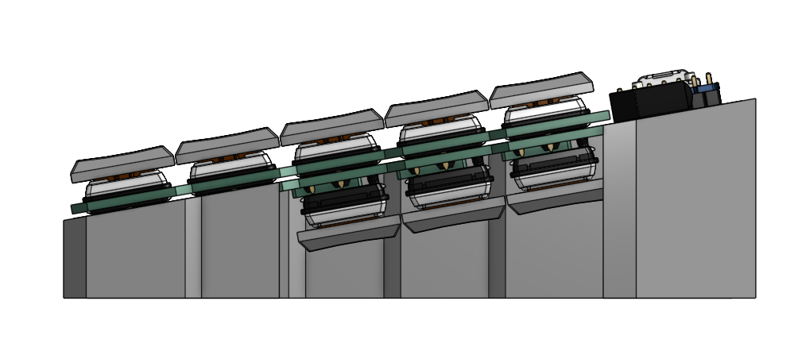
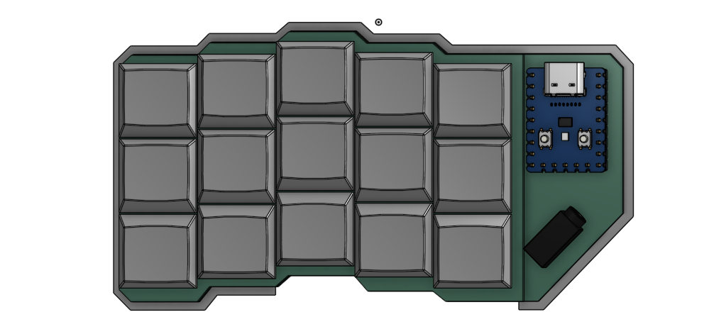

# Pincher\_Split\_keyboard (WIP)

The **Pincher Split Keyboard** is a work-in-progress split mechanical keyboard with a twist: the thumb cluster is positioned underneath the main keys.

The design philosophy is based on the natural motion of the human thumb — it's more comfortable for thumbs to pinch toward the fingers rather than push forward in the same direction.

---

## Features

- Split ergonomic layout (3 rows × 5 columns per side)
- Underslung thumb clusters
- Compact and minimalistic
- No diode soldering required

## Design Goals

- Improve thumb ergonomics
- Encourage more natural hand positioning
- Support both tented and flat setups

## Status

- PCB design: In progress
- Case design: In progress
- Firmware: TBD

## Images

## Build Instructions

*(Coming soon)*

## Future Plans

- Finalize and test PCB prototype
- Design and 3D print a matching case
- Develop QMK/VIAL firmware support
- Explore hotswap socket compatibility
- Create assembly guide and documentation
- Make board more compact for travel.

